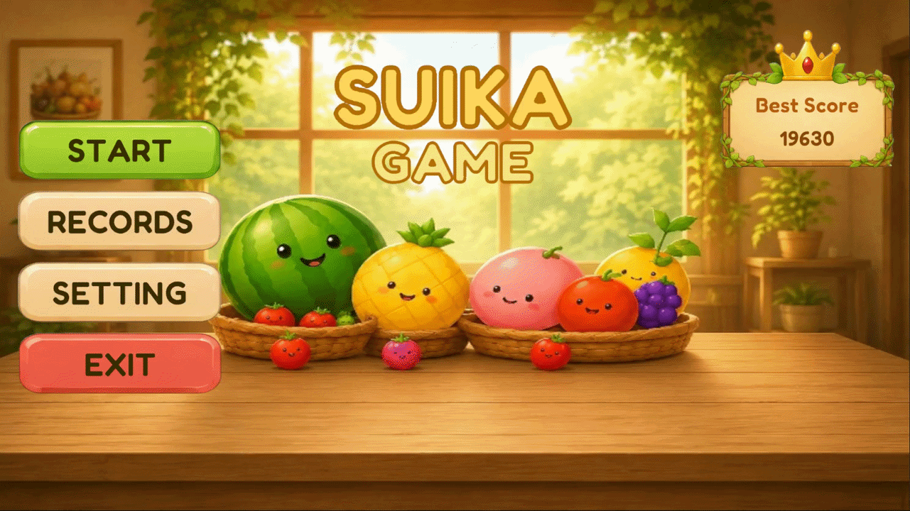
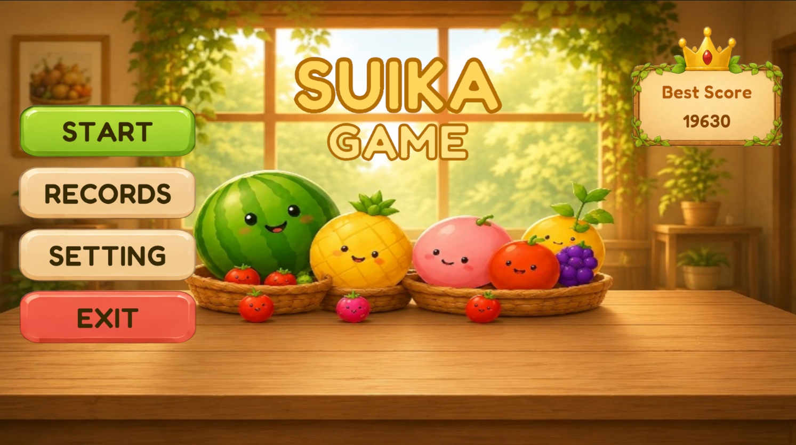
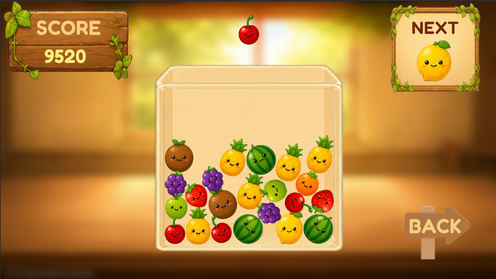
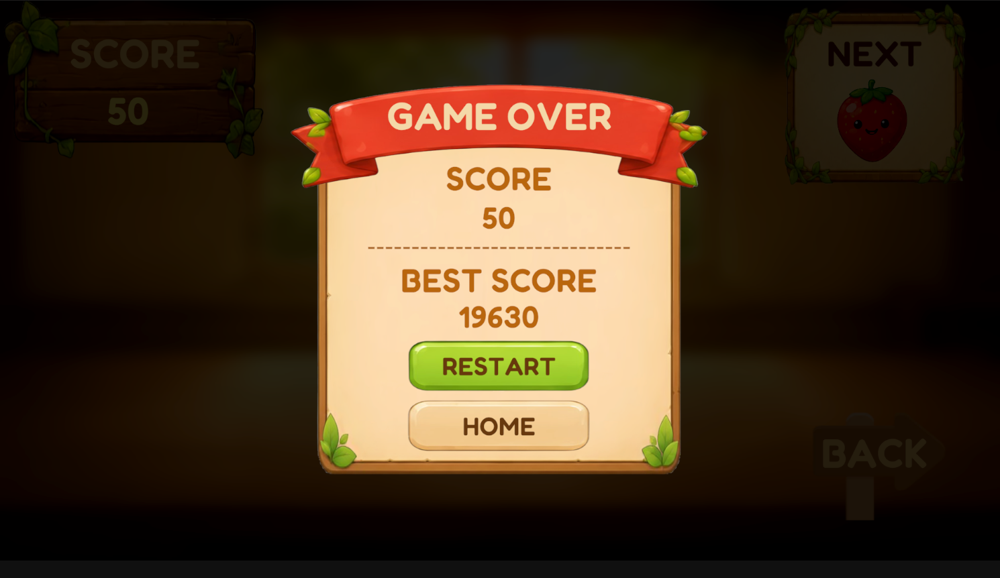
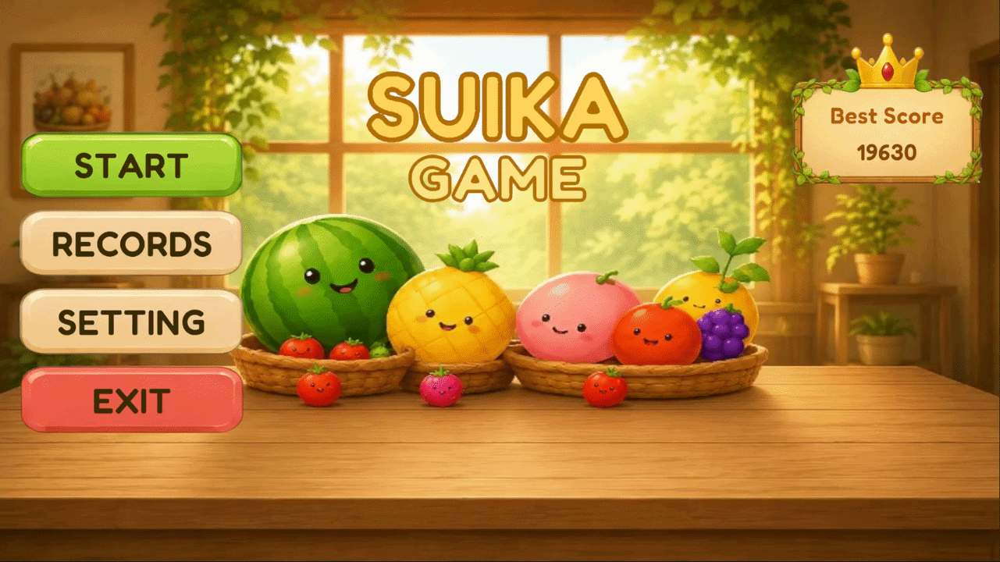

# 🍉 Suika Game

<p align="center">
  
</p>

<h1 align="center">🍉 Suika Game</h1>

<p align="center">
  A fun and addictive 2D fruit merging game made with Unity.
</p>

<p align="center">
  
</p>

<p align="center">
  
  
  
  
</p>

---

## 🎮 About the Game

**Suika Game** is a 2D fruit merging game developed with **Unity and C#**.

Drop fruits into the box, merge identical fruits together, and create bigger fruits. The goal is to keep merging fruits, increase your score, and create the biggest fruit possible.

The game features touch controls, fruit merging mechanics, sound effects, background music, statistics, high scores, and a game-over system.

---

## ✨ Features

* 🍎 Fruit dropping and merging system
* 🍊 Multiple fruit levels
* 🍉 Watermelon merging and break effect
* 💥 Fruit collision and merge effects
* 🏆 High score system
* 📊 Game statistics
* 🔊 Sound effects
* 🎵 Background music
* 🔈 Volume control
* 📱 Mobile touch controls
* 🎮 Main Menu
* 💀 Game Over system
* 🔄 Restart and Home functionality
* ⚙️ Settings panel
* 📱 Responsive UI for different screen sizes
* 💾 Persistent game statistics using PlayerPrefs

---

## 📸 Screenshots

<p align="center">
  
  
  
</p>

---

## 🎯 How to Play

1. 👆 Touch the screen to choose where to drop the fruit.
2. 🍎 Drop the fruit into the box.
3. 🔗 Merge two identical fruits.
4. 🍊 Create a bigger fruit.
5. 🍉 Continue merging fruits to reach the watermelon.
6. 🏆 Try to achieve the highest score.
7. 💥 Avoid filling the box and causing a Game Over.

---

## 🎮 Controls

### 📱 Mobile

Use your finger to move and control the fruit position, then release to drop the fruit.

### 🖥️ PC / Unity Editor

Use the mouse to simulate touch input while testing the game in the Unity Editor.

---

## 🛠️ Built With

* **Unity**
* **C#**
* **Unity 2D**
* **Unity Input System**
* **TextMeshPro**
* **PlayerPrefs**

---

## 📱 Platform

The game is designed primarily for mobile devices.

**Supported / Tested Platforms:**

* 📱 Android
* 🖥️ Windows / Unity Editor

---

## 🚀 How to Run

### 1. Clone the Repository

```bash
git clone YOUR_REPOSITORY_URL
```

### 2. Open the Project

Open the downloaded project using **Unity Hub**.

### 3. Open the Main Scene

Open the game's main menu scene.

```text
Assets/Scenes/MainMenu
```

### 4. Run the Game

Press the **Play** button in Unity.

---

---

## 🎬 Gameplay Preview

<p align="center">
  
</p>

Displays a preview of recession features and game settings.

---

## 🍉 Game Goal

The main objective is to merge matching fruits and create larger fruits while managing the available space inside the game box.

Can you reach the 🍉 **Watermelon** and achieve your highest score?

---

## 📊 Game Statistics

The game keeps track of several player statistics, including:

* 🏆 Best Score
* 🎮 Total Games
* 🔗 Total Merges

These statistics are saved locally using Unity's **PlayerPrefs** system.

---

## 🔊 Audio System

The game includes:

* 🎵 Main Menu Music
* 🎵 Gameplay Music
* 🔘 Button Sounds
* 💥 Game Over Sound
* 🍉 Fruit / Merge Effects

The volume can be adjusted through the game's settings.

---

## ⚙️ Settings

The Settings panel provides options for controlling the game's audio.

Players can adjust the overall volume and control music settings.

---

## 🔮 Future Improvements

Possible future improvements include:

* 🏅 Additional achievements
* 🎨 More visual effects
* 🌟 Improved animations
* 📱 Further device optimization
* 🏆 Online leaderboard
* 🎨 Additional themes and customization

---

## 👨‍💻 Developer

### **Mahdi Hosseinabadi**

Computer Engineering Student at
**Web Designer · UI/UX Designer · Unity Game Developer**

### 🌐 Connect with Me

<p align="center">
  <a href="https://github.com/MahdiHosseinabadi">
    
  </a>
  <a href="https://www.instagram.com/MahdiHosseinabadii">
    
  </a>
  <a href="https://t.me/MahdiHosseinabadii">
    
  </a>
</p>

<p align="center">
  <a href="https://github.com/MahdiHosseinabadi">
    <strong>View my GitHub profile →</strong>
  </a>
</p>

---

## ⭐ Support

If you like this project, consider giving the repository a ⭐ **Star** on GitHub.

It helps support the project and motivates further development.

---

<p align="center">
  Made with ❤️ and Unity
</p>
